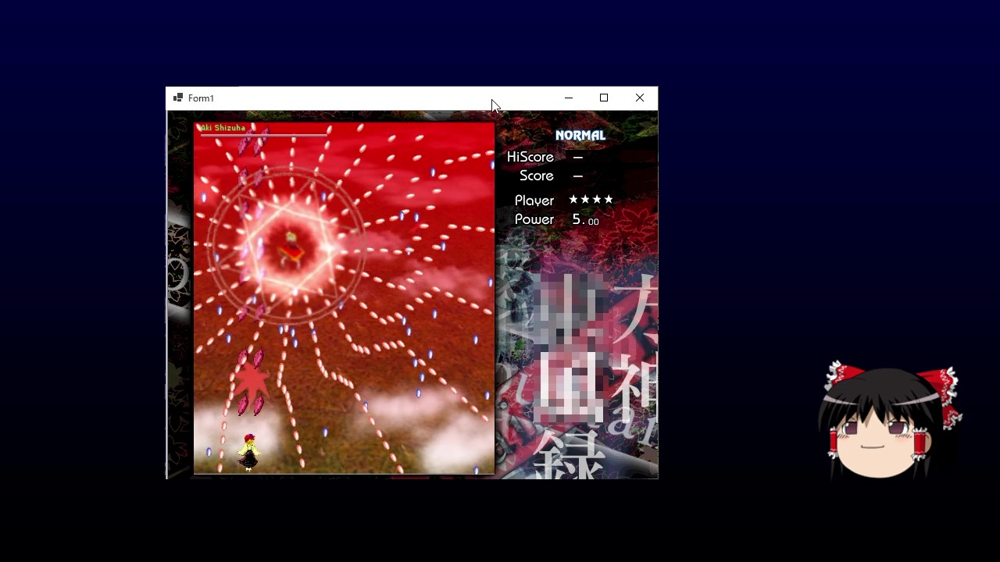

# 【ゆっくり解説】シューティングゲームの作り方 【ゲームプログラミング】
動画 [【ゆっくり解説】シューティングゲームの作り方 【ゲームプログラミング】](https://youtu.be/JeK35tEfh7c) で解説しているコードです。

## 開発環境
これをインストールしていれば、本WebサイトのCodeボタンから「Open with Visual Studio」でソースコードを丸ごとダウンロード(クローン)出来ます。
- [Visual Studio 2022](https://visualstudio.microsoft.com/ja/downloads/)
　
## プロジェクトについて
Visual StudioでShooting.slnを開き、Shootingプロジェクトをスタートアッププロジェクトに設定して実行すればプログラムが動きます。
- Shooting：完成品のプロジェクトです。
- ~Test：テスト用プロジェクトです。解説動画中で表示しているコードはここにあります。
